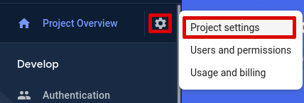
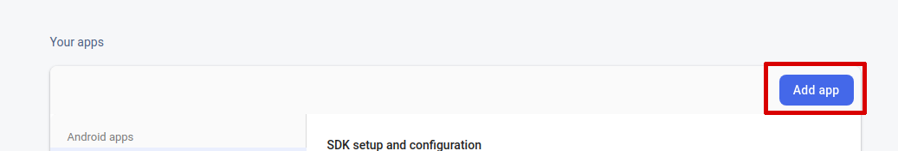
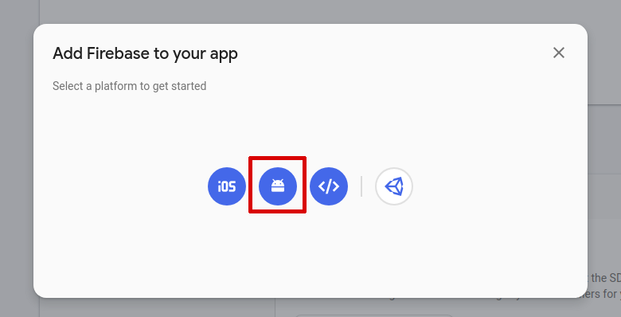
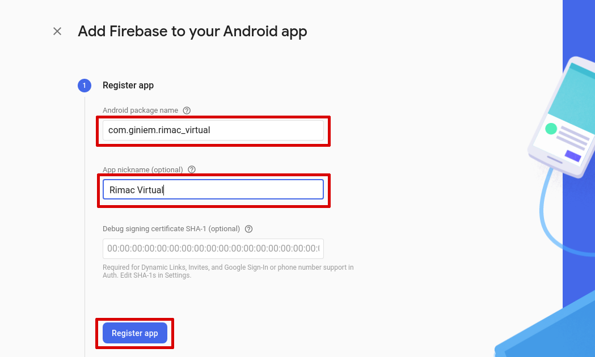
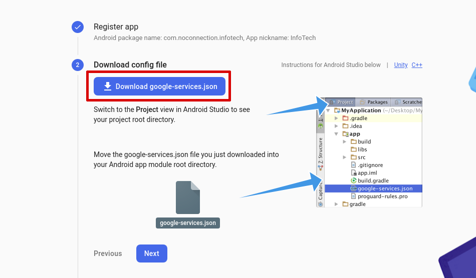
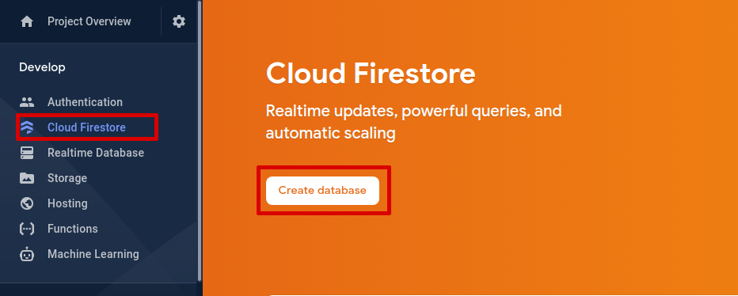
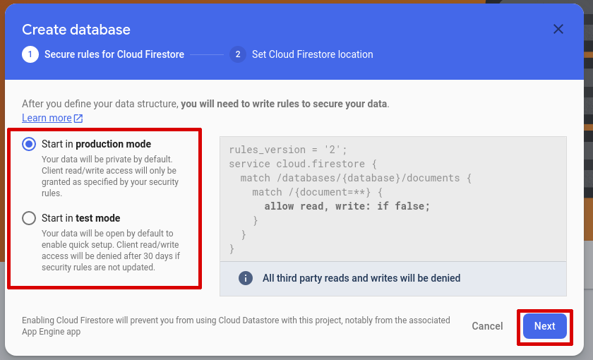
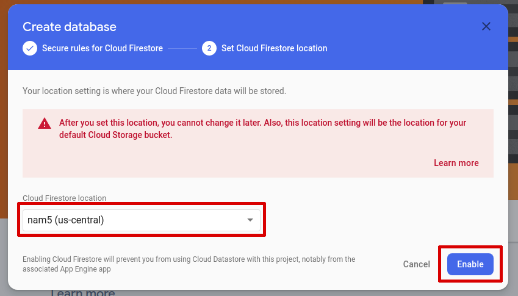
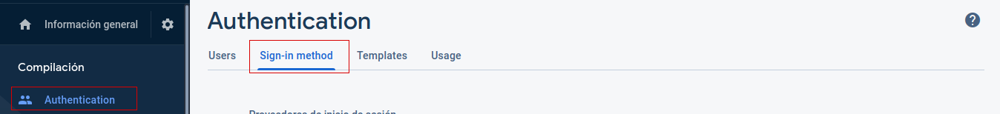

# legall_rimac_virtual

A new Flutter project.

## Getting Started

This project is a starting point for a Flutter application.

A few resources to get you started if this is your first Flutter project:

- [Lab: Write your first Flutter app](https://flutter.dev/docs/get-started/codelab)
- [Cookbook: Useful Flutter samples](https://flutter.dev/docs/cookbook)

For help getting started with Flutter, view our
[online documentation](https://flutter.dev/docs), which offers tutorials,
samples, guidance on mobile development, and a full API reference.

## Setup Firebase

To assign the Firebase account that we want to use, we must first register the Android application.

## Register the Android application
1. Go to [Firebase console](https://console.firebase.google.com/) and select the project to connect
2. Open project settings

3. Go to "Your apps" section and then click on Add app

4. Now select Android as your platform

5. Fill the Android package name field this should be "com.giniem.rimac_virtual" for this project
6. Give the app a nickname (If you want)
7. Click on "Register app"

8. Download the `google-services.json` file

This file should be placed on `android/app/google-services.json`

## Create a database
If you not have a database you will need create one

1. In the sidebar click on `Cloud Firestore`
2. Click on `Create database`

3. Select the start mode that you want and click `Next`

4. Select the desired location and click `Enable`

## Authentication
The application uses anonymous authentication so you need enable the sign-in method
1. Click `Authentication` on sidebar
2. Click `Sign-in method`
3. Switch on `Enable` on `Anonymous` sign-in method
4. Click `Save`

